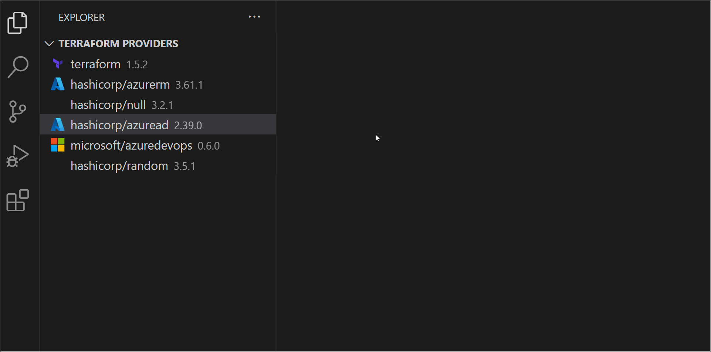
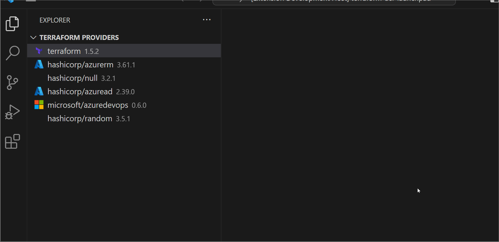

# Usage

#### - Just hover over a Terraform 'Data', 'Resource', 'Module' or 'data.<identifier>', etc.

#### - By default supports all official and partner Providers

---

#### `Commands:`

- `Terraform Quick Docs: Show Resource Documentation` list and open any resource documentation for any provider
- `Terraform Quick Docs: Show Functions Documentation` list and open any terraform function documentation
- `Terraform Quick Docs: Show Additional Documentation` list and open additional documentations

---

#### `Hovering Example:`

#### `Additional overview of required providers:`

#### `Quick refrence to all offical and partner providers:`

#### `Supports Modules in the Terraform Registry:`

