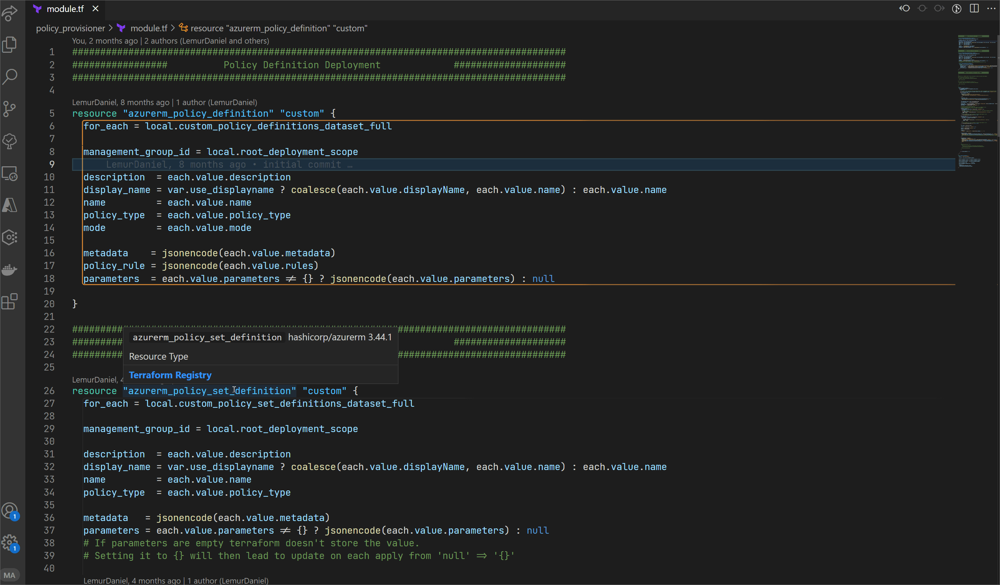
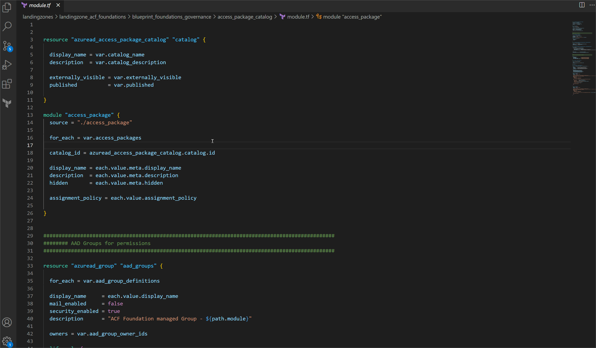
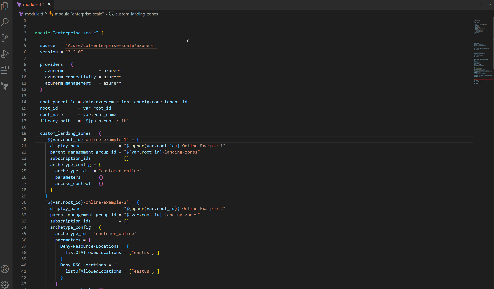
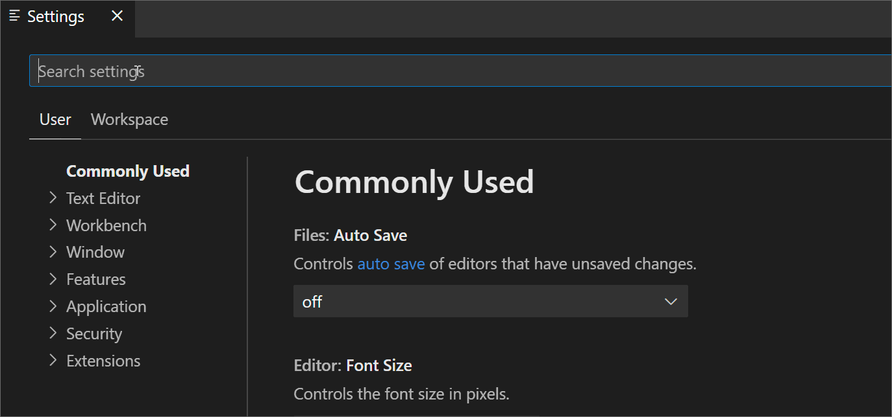

[Marketplace](https://marketplace.visualstudio.com/items?itemName=LemurDaniel.terraform-quick-docs)

# Usage

##### - `Just hover over a Terraform 'Data', 'Resource', 'Module' or 'data.<identifier>', etc.`

##### - `Autocompletion for provider yet not supported by terraform extension`

##### - `Supports only Modules in the Terraform Registry!`

##### - `By default supports all official and partner Providers`

---

#### `Example 1:`

#### `Example 2:`

#### `Example 3:`

---

#### `Commands:`

- `Terraform Quick Docs: Show supported Providers` shows all currently supported Providers by the extension
- `Terraform Quick Docs: Show Resource Documentation` list and open any resource documentation for any provider

---

##### - `Add more specific Providers if needed in the Settings:`

