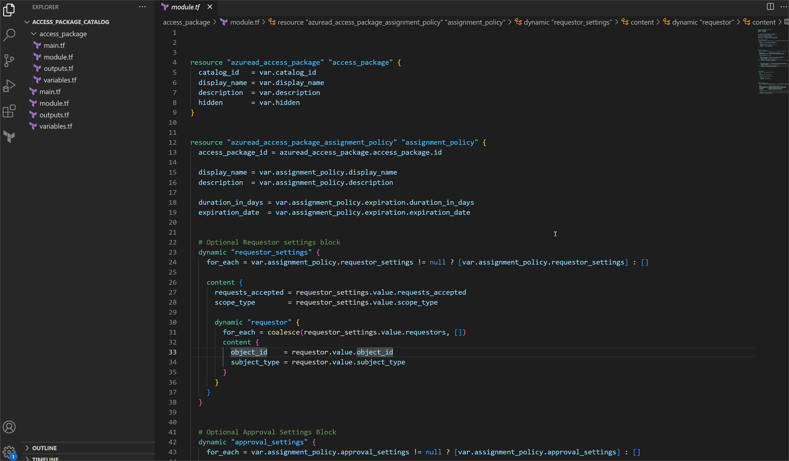
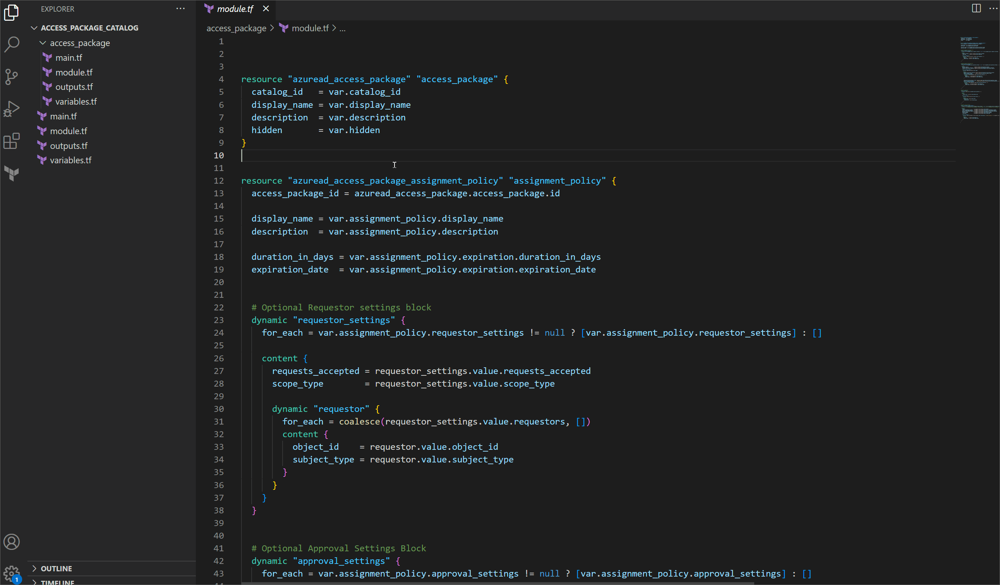

[Marketplace](https://marketplace.visualstudio.com/items?itemName=LemurDaniel.terraform-quick-docs)

# Usage

#### - Just hover over a Terraform 'Data', 'Resource', 'Module' or 'data.<identifier>', etc.

#### - By default supports all official and partner Providers

---

#### `Commands:`

- `Terraform Quick Docs: Show Resource Documentation` list and open any resource documentation for any provider
- `Terraform Quick Docs: Show Functions Documentation` list and open any terraform function documentation
- `Terraform Quick Docs: Show additional Documentation` list and open additional documentations
- `Terraform Quick Docs: Show supported Providers` shows all currently supported Providers by the extension

---

#### `Hovering Example:`

#### `Commands Example:`

#### `Supports only Modules in the Terraform Registry`:`

  
---

#### - `Add more specific Providers if needed in the Settings:`

