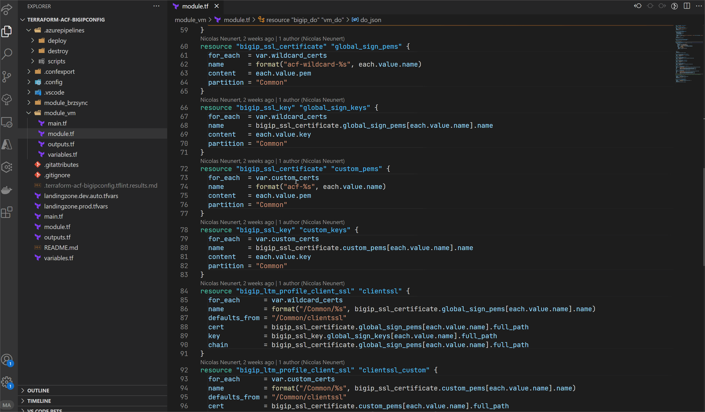

# terraform-quick-docs

Quickly open the Documentation for a Terraform Resource by hovering over it.

[Marketplace](https://marketplace.visualstudio.com/items?itemName=LemurDaniel.terraform-quick-docs)

# Usage

#### - `Just hover over a Terraform 'Data' or 'Resource' Name`

#### - `Only verified Terraform Providers are supported!`

---

### `Example 1:`

### `Example 2:`

